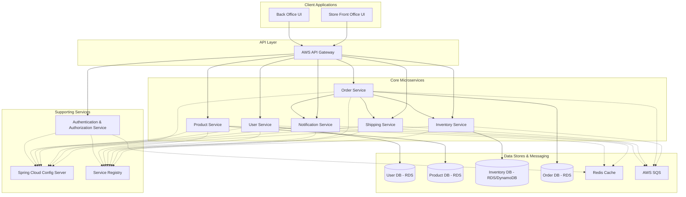

# ssc-docs
Swift Supply Chain Docs

# Supply Chain Platform: System Design & Roadmap

## 1. Project Vision & Goals
**Core Functionality**:  
Enable store front offices to manage:
- Customer profiles
- Order creation
- Shipping handling
- Receipt generation
- Order status tracking  

**Back Office Capabilities**:
- Inventory management
- Stock control
- Vendor order processing  

**Scalability & Reliability**:
- Scale with business growth
- Ensure data consistency (especially inventory in distributed systems)  

**Technology Stack**:
- **Microservices**: Spring Boot
- **Security**: Spring Security
- **Caching**: Redis
- **Cloud**: AWS (SQS, RDS/DynamoDB, EKS, API Gateway)
- **Containerization**: Docker & Kubernetes

---

## 2. System Architecture
### 2.1. High-Level Overview

