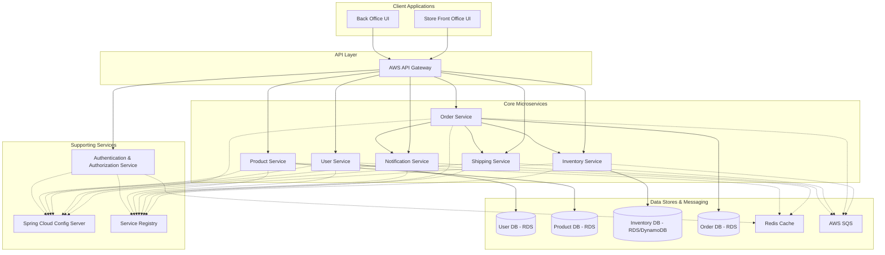

# ssc-docs
Swift Supply Chain Docs

# Supply Chain Platform: System Design & Roadmap
----------------------------------------------

This document outlines the proposed architecture, design, and roadmap for a microservices-based supply chain platform catering to small to mid-sized businesses across various sectors like furniture, fitness, and electronics.

### 1\. Project Vision & Goals

*   **Core Functionality:** Enable store front offices to manage customer profiles, create orders, handle shipping, generate receipts, and track order status.
    
*   **Back Office Capabilities:** Provide tools for inventory management, stock control, and order processing from various vendors.
    
*   **Scalability & Reliability:** Design a system that can scale with business growth and ensure data consistency, especially for inventory in a distributed environment.
    
*   **Technology Stack:** Leverage Spring Boot for microservices, Spring Security, centralized configuration, Redis for caching/session management, AWS services (SQS, RDS/DynamoDB, EKS, API Gateway), Docker, and Kubernetes.
    

### 2\. System Architecture

#### 2.1. High-Level Overview

The system will be a collection of independently deployable microservices communicating via REST APIs and asynchronous messaging (AWS SQS). An API Gateway will serve as the single entry point for all client requests (Store Front Office UI, Back Office UI).

#### 2.2. Technology Stack Summary

*   **Backend:** Java, Spring Boot, Spring Cloud (Config, Gateway/Service Registry), Spring Security
    
*   **Database:** AWS RDS (PostgreSQL/MySQL) for transactional data. Potentially AWS DynamoDB for specific high-throughput, flexible schema needs (e.g., audit logs, certain inventory aspects if hyper-scaling is needed).
    
*   **Caching:** Redis (AWS ElastiCache)
    
*   **Messaging:** AWS SQS
    
*   **Containerization & Orchestration:** Docker, Kubernetes (AWS EKS)
    
*   **API Gateway:** AWS API Gateway
    
*   **Configuration Management:** Spring Cloud Config Server
    
*   **Logging & Monitoring:** ELK Stack (Elasticsearch, Logstash, Kibana) or AWS CloudWatch.
    
*   **CI/CD:** Jenkins, GitLab CI, or AWS CodePipeline.
    

### 3\. Microservice Details

1.  **User Service:**
    
    *   **Responsibilities:** Manages user profiles (customers, store staff), addresses, authentication tokens (works with AuthService).
        
    *   **Data:** User accounts, roles, permissions, addresses.
        
    *   **Key APIs:** CRUD for users, addresses, login, registration.
        
2.  **Product Service:**
    
    *   **Responsibilities:** Manages product catalogs for different businesses. Includes product details, categories, pricing specific to businesses.
        
    *   **Data:** Products, SKUs, categories, business-specific pricing.
        
    *   **Key APIs:** CRUD for products, categories, search/filter products.
        
3.  **Inventory Service:**
    
    *   **Responsibilities:** Manages stock levels across potentially multiple warehouses. Source of truth for inventory. Handles stock adjustments, reservations.
        
    *   **Data:** Inventory items (product, warehouse, quantity), stock movements.
        
    *   **Key APIs:** Get stock level, reserve stock, confirm stock deduction, adjust stock.
        
    *   **Stale Inventory Mitigation:**
        
        *   Publishes inventory update events to SQS (e.g., StockUpdatedEvent).
            
        *   Uses optimistic locking for concurrent updates.
            
        *   May implement a reservation system where stock is held for a short period during order processing.
            
        *   Periodic reconciliation jobs.
            
4.  **Order Service:**
    
    *   **Responsibilities:** Handles order creation, processing, status updates, and history. Coordinates with Inventory, Shipping, and Notification services.
        
    *   **Data:** Orders, order items, payment details (references), order status history.
        
    *   **Key APIs:** Create order, get order details, update order status, list orders.
        
    *   **SQS Usage:**
        
        *   Publishes OrderCreatedEvent to SQS. Inventory Service subscribes to deduct stock. Notification Service subscribes to send order confirmation.
            
        *   Publishes OrderStatusChangedEvent (e.g., Dispatched, Delivered).
            
5.  **Shipping Service:**
    
    *   **Responsibilities:** Manages shipping information, generates tracking numbers (can integrate with third-party shipping APIs), updates shipment status. Generates receipts for dispatch and delivery.
        
    *   **Data:** Shipments, tracking info, carrier details, delivery addresses.
        
    *   **Key APIs:** Create shipment, get shipment status, update tracking.
        
    *   **SQS Usage:**
        
        *   Publishes ShipmentDispatchedEvent, ShipmentDeliveredEvent. Notification Service subscribes.
            
6.  **Notification Service:**
    
    *   **Responsibilities:** Sends notifications (email, SMS - potentially via AWS SNS) for various events like order confirmation, dispatch, delivery.
        
    *   **Data:** Notification templates, logs.
        
    *   **SQS Usage:** Subscribes to events from Order Service, Shipping Service, and Inventory Service (e.g., low stock alerts) to trigger notifications.
        
7.  **Authentication Service (Leveraging Spring Security):**
    
    *   **Responsibilities:** Handles user authentication (login) and token generation (JWT). Manages authorization rules.
        
    *   **Integration:** Works closely with API Gateway and other microservices to secure endpoints.
        
    *   **Redis Usage:** Stores session information or JWT revocation lists.
        
8.  **API Gateway (AWS API Gateway):**
    
    *   **Responsibilities:** Single entry point, request routing, rate limiting, authentication/authorization enforcement (delegating to AuthService), SSL termination, request/response transformation.
        
9.  **Configuration Service (Spring Cloud Config Server):**
    
    *   **Responsibilities:** Centralized management of configuration for all microservices. Configurations stored in a Git repository.
        

### 4\. Data Entities (Conceptual Model)

*   **Business:** (BusinessID, Name, Type, ContactInfo)
    
*   **StoreFront:** (StoreID, BusinessID, Name, Location, StaffUserIDs)
    
*   **User:** (UserID, Username, PasswordHash, Email, FirstName, LastName, Role, IsActive, CreatedAt, UpdatedAt)
    
*   **Address:** (AddressID, UserID, Street, City, State, ZipCode, Country, Type (Shipping/Billing), IsDefault)
    
*   **Product:** (ProductID, BusinessID, SKU, Name, Description, Category, UnitPrice, AttributesJSON, IsActive, CreatedAt, UpdatedAt)
    
*   **Warehouse:** (WarehouseID, Name, Location, ContactInfo)
    
*   **InventoryItem:** (InventoryItemID, ProductID, WarehouseID, QuantityOnHand, QuantityReserved, QuantityAvailable, LastStockUpdate, Version) (Version for optimistic locking)
    
*   **Order:** (OrderID, UserID, StoreID, OrderDate, Status (Pending, Confirmed, Processing, Dispatched, Delivered, Cancelled), TotalAmount, Currency, ShippingAddressID, BillingAddressID, CreatedAt, UpdatedAt)
    
*   **OrderItem:** (OrderItemID, OrderID, ProductID, Quantity, UnitPriceAtOrder, TotalPrice)
    
*   **Shipment:** (ShipmentID, OrderID, CarrierName, TrackingNumber, DispatchDate, EstimatedDeliveryDate, ActualDeliveryDate, Status (PendingDispatch, InTransit, Delivered, FailedDelivery), SourceWarehouseID, ShippingCost)
    
*   **Receipt:** (ReceiptID, OrderID, ShipmentID (optional), Stage (Ordered, Dispatched, Delivered), GeneratedAt, Content (e.g., PDF link or structured data))
    
*   **Vendor:** (VendorID, Name, ContactInfo, ProductsSuppliedJSON)
    
*   **StockMovement:** (MovementID, ProductID, WarehouseID, Type (Inbound, Outbound, Adjustment), Quantity, Reason, Timestamp, OrderID (optional), UserID (staff who made adjustment))
    

### 5\. Key Business Flows

1.  **Store Front Creates User Profile:**
    
    *   Store staff accesses Store Front UI.
        
    *   Enters customer details -> POST /users to User Service via API Gateway.
        
    *   Adds addresses -> POST /users/{userId}/addresses.
        
2.  **Store Front Creates Order:**
    
    *   Staff selects customer, adds products to cart.
        
    *   UI calculates total -> POST /orders to Order Service.
        
    *   Order Service:
        
        1.  Validates request.
            
        2.  (Optional) Creates a temporary stock reservation with Inventory Service.
            
        3.  Saves order in Pending state.
            
        4.  Publishes OrderCreatedEvent to SQS.
            
    *   Inventory Service (consumes OrderCreatedEvent):
        
        1.  Decrements stock for ordered items (using optimistic locking).
            
        2.  If stock unavailable, publishes StockUnavailableEvent (Order Service might listen to update order status or initiate backorder flow).
            
        3.  Publishes StockUpdatedEvent.
            
    *   Notification Service (consumes OrderCreatedEvent):
        
        1.  Sends "Order Confirmed" receipt/notification to the customer.
            
    *   Order Service updates order status to Confirmed.
        
3.  **Inventory Management (Back Office):**
    
    *   Staff views inventory levels (GET /inventory?productId=...&warehouseId=...).
        
    *   Staff updates stock (e.g., new shipment from vendor) -> PUT /inventory/items/{itemId} or POST /inventory/adjustments.
        
    *   Inventory Service updates stock and publishes StockUpdatedEvent.
        
4.  **Order Fulfillment & Tracking:**
    
    *   **Dispatch:**
        
        1.  Back office staff marks order for dispatch.
            
        2.  Triggers Shipping Service -> POST /shipments (associating with OrderID).
            
        3.  Shipping Service generates tracking, updates status to InTransit.
            
        4.  Publishes ShipmentDispatchedEvent to SQS.
            
        5.  Order Service consumes event, updates order status to Dispatched.
            
        6.  Notification Service consumes event, sends "Order Dispatched" receipt/notification with tracking info.
            
    *   **Delivery:**
        
        1.  Shipping Service (receives update from carrier or manual update) updates shipment status to Delivered.
            
        2.  Publishes ShipmentDeliveredEvent.
            
        3.  Order Service consumes, updates order status to Delivered.
            
        4.  Notification Service consumes, sends "Order Delivered" receipt/notification.
            
5.  **Receipt Generation:**
    
    *   Receipts are generated at different stages (Ordered, Dispatched, Delivered).
        
    *   Notification Service can be responsible for compiling receipt data (from Order, Product, User services) and generating it (e.g., PDF or structured email content) upon consuming relevant events.
        

### 6\. Technology Integration Details

*   **Redis Usage:**
    
    *   **Caching:** Product details, user profiles, frequently accessed configurations.
        
        *   _Example:_ Cache product data in Product Service to reduce DB load.
            
    *   **Session Management:** Store user session data for API Gateway/AuthService.
        
    *   **Rate Limiting:** Implement API rate limits at the API Gateway level, potentially using Redis for counters.
        
    *   **Distributed Locks (Use with Caution):** For short-lived critical sections if optimistic locking is insufficient in Inventory Service, though often database-level optimistic locking or a dedicated distributed lock manager (like ZooKeeper/etcd if already in use) is preferred for robustness. For inventory, event-driven approaches with compensation are generally better.
        
    *   **Leaderboards/Real-time Stats (Future):** If you need to show top-selling products, etc.
        
*   **AWS SQS Usage:**
    
    *   **Decoupling Services:**
        
        *   Order Service publishes OrderCreatedEvent -> Inventory Service & Notification Service subscribe.
            
        *   Inventory Service publishes StockUpdatedEvent -> Potentially other services (e.g., a replenishment service) subscribe.
            
        *   Shipping Service publishes ShipmentStatusChangedEvent -> Order Service & Notification Service subscribe.
            
    *   **Asynchronous Task Processing:**
        
        *   Generating complex reports.
            
        *   Sending bulk notifications.
            
        *   Processing batch inventory updates.
            
    *   **Buffering & Smoothing Load:**
        
        *   During peak order times, SQS can buffer requests to the Inventory Service, preventing it from being overwhelmed.
            
    *   **Dead Letter Queues (DLQs):** Configure DLQs for SQS queues to handle messages that cannot be processed successfully, allowing for investigation and reprocessing.
        
*   **Spring Security:**
    
    *   Implement OAuth2 or JWT-based authentication.
        
    *   Central Authentication Service (or integrated within API Gateway/User Service initially).
        
    *   Role-based access control (RBAC) for different user types (customer, store staff, back-office admin).
        
    *   Secure inter-service communication (e.g., using service accounts or token relay).
        
*   **Docker & Kubernetes (AWS EKS):**
    
    *   Each microservice will be packaged as a Docker container.
        
    *   Kubernetes will be used for deployment, scaling (Horizontal Pod Autoscaler), service discovery, load balancing, and self-healing of services on AWS EKS.
        

### 7\. Addressing Stale Inventory in Distributed Systems

This is a critical challenge. A multi-pronged approach:

1.  **Single Source of Truth:** The Inventory Service is the _only_ service that directly modifies inventory quantities.
    
2.  **Eventual Consistency:** Accept that other services might have slightly delayed views of inventory. The UI should reflect this or manage expectations.
    
3.  // In InventoryItem entity// @Version// private Long version;
    
4.  **Asynchronous Updates via SQS:** When an order is placed, the Order Service can publish an OrderPendingConfirmationEvent. The Inventory Service consumes this, attempts to allocate stock. If successful, it publishes StockAllocatedEvent; if not, StockAllocationFailedEvent. The Order Service listens for these to confirm or reject the order.
    
5.  **Compensating Transactions (Saga Pattern):** For complex operations spanning multiple services (e.g., order creation involving payment, inventory, notification), if one step fails, subsequent steps must be rolled back. Sagas can be implemented using choreography (events) or orchestration (a central coordinator).
    
    *   _Example (Choreography):_ Order Service creates order (pending) -> emits OrderCreated. Inventory Service listens, reserves stock -> emits StockReserved. Payment Service listens, processes payment -> emits PaymentProcessed. If StockReservationFailed or PaymentFailed, compensating events are emitted to roll back.
        
6.  **Reservation System:** Inventory Service can offer an API to temporarily "reserve" stock for a short period (e.g., 5-10 minutes) while a customer completes checkout. If the order isn't confirmed within that window, the reservation expires.
    
7.  **Real-time Communication (Optional, for UI):** For UIs displaying stock, consider WebSockets or Server-Sent Events (SSE) fed by the Inventory Service to provide near real-time updates, but this adds complexity. A more common approach is to re-fetch or rely on slightly delayed data with clear indicators.
    
8.  **Atomic Operations where Possible:** If a business has only one front office and one warehouse, some operations can be simpler. The design should cater to the more complex distributed scenario.
    
9.  **Business Logic for Discrepancies:** Define how to handle situations where an order is placed for an out-of-stock item due to staleness (e.g., backorder, offer alternatives, cancel item).
    

### 8\. API Design Examples (High-Level)

**User Service:**

*   POST /api/v1/users (Create user)
    
*   GET /api/v1/users/{userId}
    
*   PUT /api/v1/users/{userId}
    
*   POST /api/v1/users/{userId}/addresses
    
*   GET /api/v1/users/{userId}/addresses
    
*   POST /api/v1/auth/login
    
*   POST /api/v1/auth/register (if self-service registration is allowed)
    

**Product Service:**

*   POST /api/v1/products (Admin only)
    
*   GET /api/v1/products?businessId={businessId}&category={category}&searchTerm={term}
    
*   GET /api/v1/products/{productId}
    

**Inventory Service:**

*   GET /api/v1/inventory/stock?productId={productId}&warehouseId={warehouseId}
    
*   POST /api/v1/inventory/reservations (Reserve stock)
    
*   DELETE /api/v1/inventory/reservations/{reservationId} (Cancel reservation)
    
*   POST /api/v1/inventory/adjustments (Adjust stock levels, e.g., for received goods, discrepancies)
    

**Order Service:**

*   POST /api/v1/orders (Body: { userId, storeId, items: \[{productId, quantity}\], shippingAddressId, billingAddressId })
    
*   GET /api/v1/orders/{orderId}
    
*   GET /api/v1/orders?userId={userId}&status={status}
    
*   PUT /api/v1/orders/{orderId}/status (e.g., cancel order)
    

**Shipping Service:**

*   POST /api/v1/shipments (Body: { orderId, carrier, warehouseId }) -> returns tracking info
    
*   GET /api/v1/shipments/{shipmentId}
    
*   GET /api/v1/shipments/tracking/{trackingNumber}
    
*   POST /api/v1/shipments/{shipmentId}/receipts (Generate dispatch/delivery receipt)
    

**Notification Service (Internal or triggered via events):**

*   (Typically consumes SQS messages, may not have many direct external APIs unless for manual trigger/testing)
    

### 9\. Structured Development Roadmap for Incremental & Exponential Growth

This roadmap emphasizes building a solid foundation (Phase 0) that enables rapid, modular development and scaling of features and services.

**Phase 0: Foundation & Core Infrastructure (The "Base" for Exponential Growth) (2-4 Months)**

*   **Goal:** Establish all common infrastructure, CI/CD pipelines, core shared libraries/modules, and development best practices. This phase is crucial for enabling subsequent rapid development.
    
*   **Deliverables:**
    
    *   **Version Control & Collaboration:**
        
        *   VCS (Git) repository setup (e.g., GitHub, GitLab, AWS CodeCommit).
            
        *   Branching strategy defined (e.g., GitFlow).
            
        *   Code review processes established.
            
    *   **CI/CD Automation:**
        
        *   CI/CD pipeline (e.g., Jenkins, GitLab CI, AWS CodePipeline) configured for:
            
            *   Automated builds for each microservice.
                
            *   Unit and integration test execution.
                
            *   Static code analysis.
                
            *   Automated deployment to Development and Staging environments.
                
    *   **Infrastructure as Code (IaC):**
        
        *   IaC scripts (e.g., Terraform, AWS CloudFormation) for provisioning:
            
            *   Virtual Private Cloud (VPC) and networking.
                
            *   Kubernetes cluster (AWS EKS) basics.
                
            *   Relational Database (AWS RDS instance).
                
            *   Caching (AWS ElastiCache for Redis).
                
            *   Message Queues (AWS SQS basic setup).
                
            *   IAM roles and policies for services.
                
    *   **Core Platform Services:**
        
        *   Spring Cloud Config Server: Setup and initial configuration repository.
            
        *   Service Registry & Discovery (e.g., Eureka, Consul, or Kubernetes native): Setup and integration.
            
        *   API Gateway (AWS API Gateway): Initial configuration for routing and basic security.
            
    *   **Development Standards & Templates:**
        
        *   Base Spring Boot project template for microservices, including:
            
            *   Standardized logging framework (e.g., SLF4J with Logback).
                
            *   Health check endpoints.
                
            *   Configuration for Spring Cloud Config Client.
                
            *   Basic Spring Security setup for service-to-service communication.
                
            *   Common DTOs and standardized error handling mechanisms.
                
        *   Dockerfiles and Docker Compose setup for local development environments.
            
        *   Initial database schemas designed and version-controlled (e.g., using Flyway, Liquibase).
            
    *   **Security Foundations:**
        
        *   Basic network security groups (NSGs) and Access Control Lists (ACLs).
            
        *   Secrets management strategy (e.g., AWS Secrets Manager, HashiCorp Vault integration).
            
    *   **Monitoring & Logging Basics:**
        
        *   Initial setup for centralized logging (e.g., forwarding logs to AWS CloudWatch Logs).
            
        *   Basic metrics collection.
            

**Phase 1: MVP - Core User, Product & Order Workflow (Building on the Base) (3-5 Months)**

*   **Goal:** Implement the minimum viable product focusing on the core flow: user creation, product management, and initial order placement.
    
*   **Services (Develop core logic on top of Phase 0 templates):**
    
    *   **Authentication Service:** JWT generation and validation, integration with API Gateway.
        
    *   **User Service:** CRUD operations for user profiles (customers, store staff by admin), basic role assignment.
        
    *   **Product Service:** CRUD operations for product catalogs (managed by back-office staff/admin).
        
    *   **Order Service:**
        
        *   Order creation API (capturing items, user, store).
            
        *   Initial order status: Pending.
            
        *   Publish OrderCreatedEvent to SQS (skeleton event, no consumers yet or basic logger consumer).
            
    *   **Inventory Service (Skeleton):**
        
        *   API to manually set initial stock for products (no real-time deduction yet).
            
        *   API to view current (manually set) stock.
            
*   **Key Flows:**
    
    *   Authenticated staff can log in.
        
    *   Staff can create/manage customer profiles.
        
    *   Staff/Admin can create/manage products.
        
    *   Staff can view products and create a basic order (which goes to Pending status).
        
*   **Frontends (Simple, functional UIs):**
    
    *   Store Front UI: Login, user creation (by staff), product listing, basic order creation.
        
    *   Back Office UI: Login, product management, user management, view pending orders.
        
*   **Focus:** Validating the end-to-end flow with the foundational infrastructure. Ensuring services can communicate, configurations are loaded, and basic data persistence works.
    

**Phase 2: MVP Enhancement - Inventory Integration & Basic Fulfillment Logic (Iterating Exponentially) (3-4 Months)**

*   **Goal:** Integrate inventory management into the order flow and introduce basic notification and fulfillment concepts.
    
*   **Services (Adding depth and inter-service communication):**
    
    *   **Inventory Service:**
        
        *   Subscribe to OrderCreatedEvent from SQS.
            
        *   Implement stock deduction logic (using optimistic locking).
            
        *   Handle cases where stock is unavailable (e.g., publish StockAllocationFailedEvent).
            
        *   Publish StockUpdatedEvent after changes.
            
        *   API for back-office staff to perform stock adjustments (e.g., receiving new stock).
            
    *   **Order Service:**
        
        *   Subscribe to StockAllocatedEvent / StockAllocationFailedEvent to update order status (e.g., to Confirmed or AwaitingStock).
            
    *   **Notification Service (Initial Implementation):**
        
        *   Subscribe to OrderConfirmedEvent (published by Order Service).
            
        *   Send basic email notification for order confirmation (simple text/HTML, no complex receipt yet).
            
*   **Key Flows:**
    
    *   Order creation now attempts to reserve/deduct from actual inventory.
        
    *   Order status updates based on inventory availability.
        
    *   Customers receive a basic order confirmation email.
        
    *   Back-office staff can manage stock levels.
        
*   **Focus:** Leveraging SQS for robust, asynchronous communication. Demonstrating modular growth by fleshing out the Notification Service and making Inventory Service more dynamic.
    

**Phase 3: Expanding Core - Shipping, Tracking & Full Order Lifecycle (3-4 Months)**

*   **Goal:** Implement the shipping process, enable order tracking, and complete the basic order lifecycle through to delivery.
    
*   **Services:**
    
    *   **Shipping Service (New Service):**
        
        *   API to create a shipment record linked to an order.
            
        *   API to manually input carrier and tracking number.
            
        *   Publish ShipmentDispatchedEvent and ShipmentDeliveredEvent (based on manual updates initially).
            
    *   **Order Service:**
        
        *   Subscribe to ShipmentDispatchedEvent and ShipmentDeliveredEvent to update order status (e.g., Dispatched, Delivered).
            
    *   **Notification Service:**
        
        *   Subscribe to shipment events to send dispatch and delivery notifications.
            
        *   Implement basic receipt generation for "Dispatched" and "Delivered" stages.
            
*   **Key Flows:**
    
    *   Back-office staff can mark orders as dispatched and enter tracking information.
        
    *   Order status reflects dispatch and delivery.
        
    *   Customers receive notifications for dispatch and delivery, including tracking info.
        
*   **Frontends:**
    
    *   Store Front/Customer Portal: View order status and tracking information.
        
    *   Back Office UI: Manage shipments, update tracking.
        
*   **Focus:** Adding new, independent services (Shipping Service) and expanding existing ones to cover the full order lifecycle. The system's modularity allows for parallel development.
    

**Phase 4: Advanced Features, Scalability & Reliability (4-6 Months)**

*   **Goal:** Introduce more complex features, robustly address stale inventory, enhance user management, and focus on production readiness (scaling, monitoring, reliability).
    
*   **Features & Service Enhancements:**
    
    *   **Inventory Service:**
        
        *   Multi-warehouse support (if required by businesses).
            
        *   Stock reservation API (short-term hold during checkout).
            
        *   Advanced strategies for stale inventory (e.g., Saga pattern for complex order fulfillment parts if optimistic locking + events prove insufficient for specific scenarios).
            
        *   Periodic reconciliation jobs.
            
    *   **User Service:**
        
        *   Customer address management (multiple addresses, default shipping/billing).
            
    *   **Notification Service:**
        
        *   Full receipt lifecycle with more detailed/branded receipts (potentially PDF generation).
            
    *   **Back Office Enhancements:**
        
        *   Comprehensive inventory management (stock movements, audit trails, vendor PO tracking concepts).
            
        *   Advanced order management features.
            
    *   **Redis Integration:**
        
        *   Implement caching for frequently accessed data (products, user profiles) to improve performance.
            
        *   Use Redis for session management in AuthService/API Gateway.
            
*   **Infrastructure & Operations:**
    
    *   Full deployment to Kubernetes (AWS EKS) for production environment.
        
    *   Configure Horizontal Pod Autoscaler (HPA) for key services.
        
    *   Implement comprehensive centralized logging and monitoring (e.g., ELK Stack or enhanced AWS CloudWatch with dashboards and alerts).
        
    *   Robust backup and recovery procedures for databases and critical data.
        
    *   Load testing and performance tuning.
        
*   **Focus:** Building on the stable, modular base to add complexity and ensure the system is production-ready. The ability to scale components independently becomes critical here.
    

**Phase 5: Optimization, Further Growth & Specialization (Ongoing)**

*   **Features:**
    
    *   Support for specific needs of diverse business types (e.g., custom attributes for furniture, batch tracking for electronics).
        
    *   Advanced analytics and reporting dashboards for businesses.
        
    *   Mobile application for store staff or end customers.
        
    *   Third-party integrations (e.g., accounting systems, payment gateways if not already part of a separate payment service, advanced shipping provider APIs).
        
    *   Vendor portal for direct inventory updates or order management by vendors.
        
*   **Optimization:**
    
    *   Continuous performance tuning of services and databases.
        
    *   Cost optimization of AWS resources.
        
    *   Ongoing security hardening, regular vulnerability scanning, and penetration testing.
        
    *   Exploring new technologies or AWS services to enhance capabilities or efficiency.
        
*   **Focus:** Continuous improvement, responding to market needs, and leveraging the flexible architecture for long-term evolution.
    

This structured roadmap, starting with a strong foundational phase, should allow your team to build components incrementally and add new services or features "exponentially" as the core system matures and business needs dictate.

### 10\. Security Considerations

*   **Authentication:** Strong authentication mechanisms (OAuth 2.0 / JWT).
    
*   **Authorization:** Role-Based Access Control (RBAC) at API Gateway and service levels.
    
*   **Data Encryption:** TLS for data in transit. Encryption at rest for databases and S3 (if used).
    
*   **Input Validation:** Rigorous validation at API Gateway and service layers to prevent injection attacks (SQLi, XSS).
    
*   **Secrets Management:** Use AWS Secrets Manager or HashiCorp Vault for database credentials, API keys.
    
*   **Secure Inter-service Communication:** mTLS or token-based auth between services.
    
*   **Regular Security Audits & Penetration Testing.**
    
*   **OWASP Top 10:** Adhere to best practices.
    

This detailed plan should provide a strong starting point. Remember that this is a high-level design, and many details will be refined during the development process. Agile methodologies will be beneficial to adapt to changing requirements and learnings.

